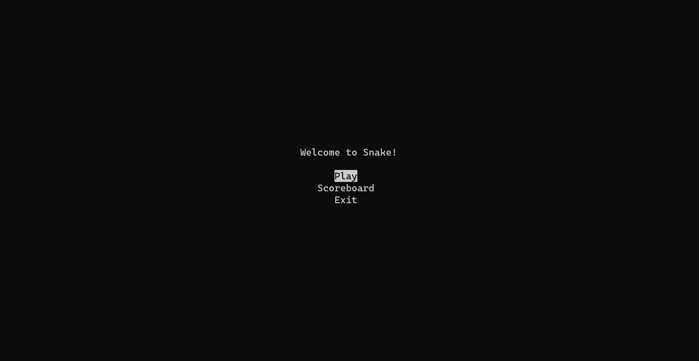
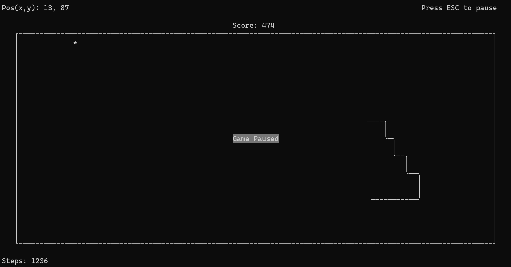
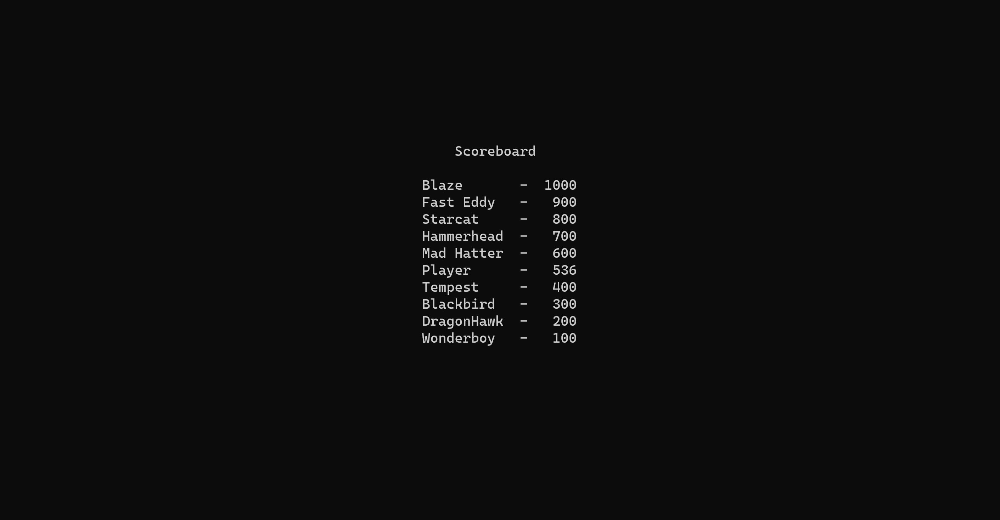

<h1 align="center">
p-Snake
</h1>
<h2>A Python curses snake implentation.</h2>
<h6>This is a little project I wrote to learn the basics of Curses.</h6>
The game has the  following features
<ul>
<li>A start menu</li>
<li>A scoreboard with persistent storage</li>
<li>A gamescore that rewards speed. Higher score the faster apples are gathered</li>
<li>A pause mode when pressing ESC</li>
</ul>

# License
MIT licensed - attribution not required. You may use this however you like.