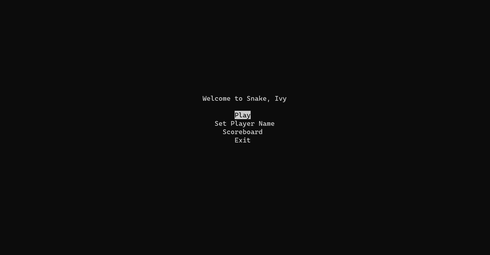
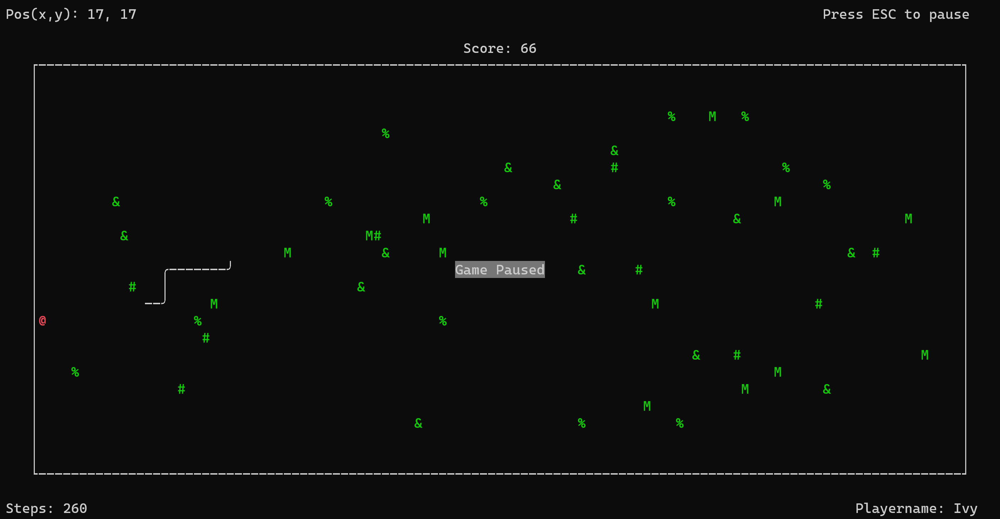

<h1 align="center">
p-Snake
</h1>
<h2>A Python curses snake implentation.</h2>
<h6>This is a little project I wrote to learn the basics of Curses.</h6>
The game has the following features.
<ul>
<li>A start menu</li>
<li>A scoreboard with persistent storage</li>
<li>Can set playername and have it saved in persistent storage</li>
<li>Gamescore that rewards speed. Score accumulation increases the faster apples are gathered</li>
<li>Tree obstacles that ends the game when colliding</li>
<li>Apples that makes the snake grow and increments the score</li>
<li>A pause screen</li>
</ul>

# License
MIT licensed - attribution not required. You may use this however you like.
